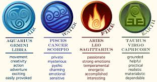

# Zodiac Controllers

## Pre-reqs
* node/express/ejs/express-ejs-layouts (for part 1)
* controllers (for part 2)

## Part 1: EJS & EJS Layouts

* fork & clone this repo
* make this repo a node project by running `npm init -y`
* create your entry point file
* install express and set it up in your `index.js`
* Install and configure `ejs`
* Install and configure `express-ejs-layouts`
* Stub out the 4 routes below using `res.send()`, just to make sure they're working
* Create a `views` folder with a `layout.ejs` that contains the boilerplate and a header that says **Zodiac Controller**
* Create a view for your home route (`index.ejs`) that says "Let's learn about the signs!" and includes links to the other four routes. Make your home route `res.render` this view.
* Create a view for each of the four categories of signs. Each view should recieve an array of traits that it displays to the page using a `forEach` loop.

| URL Pattern  | Content |
| ------------- | ------------- |
| /  | 3 navigation links (/water, /air, /fire, /earth) |
| /water | list of water signs and relevant traits from the graphic 
above  |[Private, Mysterious, Psychic, Charming, Emotional, Sensitive]

| /air | list of air signs and relevant traits from the graphic 

above  |[Movement, Creativity, Action, Adventure, Exciting, Easily Provoked]

| /fire | list of fire signs and relevant traits from the graphic 

above  |[Passionate, Strong Emotions, Tempermental, Energetic, Accomplished, Interesting]

| /earth | list of earth sign and relevant traits from the graphic above  |
[Grounded, Helpful, Practical, Realistic, Materialistic, Dependable]
---

## Part 2: Controllers

* Add the following routes to your app.
* Organize the routes into controllers based on category (your controllers folder should have four files in it, one for each category).
* Verify that all routes work as described in table!

| URL Pattern  | Content |
| ------------- | ------------- |
| /water/cancer | image of cancer symbol  |
| /water/scorpio | image of scorpio symbol  |
| /water/pisces | image of pisces symbol  |

[Private, Mysterious, Psychic, Charming, Emotional, Sensitive]

| /air/gemini | image of gemini symbol  |
| /air/libra | image of libra symbol  |
| /air/aquarius | image of aquarius symbol |

[Movement, Creativity, Action, Adventure, Exciting, Easily Provoked]

| /fire/leo | image of leo symbol  |
| /fire/aries | image of aries symbol  |
| /fire/sagittarius | image of sagittarius symbol |

[Passionate, Strong Emotions, Tempermental, Energetic, Accomplished, Interesting]

| /earth/taurus | image of taurus symbol  |
| /earth/virgo | image of virgo symbol  |
| /earth/capricorn | image of capricorn symbol |

[Grounded, Helpful, Practical, Realistic, Materialistic, Dependable]

Template Tag Names <%= ALMIGHTY SQUID injects data onto the page <% FLOUNDER allows you to write js in your html (does stuff but doesn't show stuff) <%- STINGRAY "includes" where we include an ejs file inside another file

%> CLOSING TIME FLOUNDER required to stop the javascripting